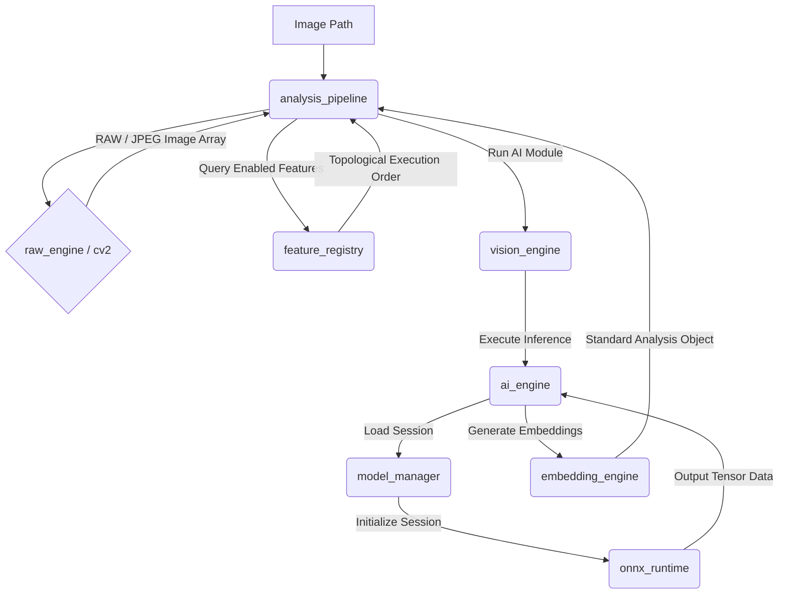

# AI Subsystem Architecture — QuantileCull V1.2

This document details the high-level architecture, thread boundaries, component interactions, and execution flow of the QuantileCull V1.2 AI Vision Foundation.

---

## 1. Architectural Blueprint

The subsystem isolates machine learning dependencies and execution models, exposing a clean set of public APIs to the rest of the application.

---

## 2. Component Design & Responsibilities

1. **`onnx_runtime`**: Isolates all direct calls to `onnxruntime`. Wraps session creations, configures graph optimization levels, and manages DirectML, CUDA, and CPU providers.
2. **`model_manager`**: Discovers model files, checks SHA-256 integrity, resolves inputs/outputs metadata shapes, and caches runtime session objects to prevent reload overheads.
3. **`ai_engine`**: Handles device selection (DML/CUDA/CPU), initializes sessions, and enqueues thread-safe inference executions.
4. **`feature_registry`**: Registers AI modules and maps execution sequences via topological sorting.
5. **`embedding_engine`**: Framework for generating normalized visual vectors, storing base64 strings, and comparing cosine distances.
6. **`analysis_pipeline`**: Orchestrator that loads images, runs pre-processors, triggers AI modules sequentially, and yields the final Standard Analysis Object JSON schema.

---

## 3. Threading & Thread Isolation

All AI calculations are completely isolated from the user interface thread:
* PyWebView UI events trigger asynchronous tasks managed by `background_tasks`.
* Task threads load image arrays, invoke `analysis_pipeline.run_pipeline`, and cache outcomes.
* Inference routines inside `ai_engine` utilize a global synchronization lock (`Lock`) to guarantee that concurrent workers (e.g. adjacent preloading thread pools) execute queries safely.
* PyWebView main event loop remains free, keeping UI response times fast and smooth.
