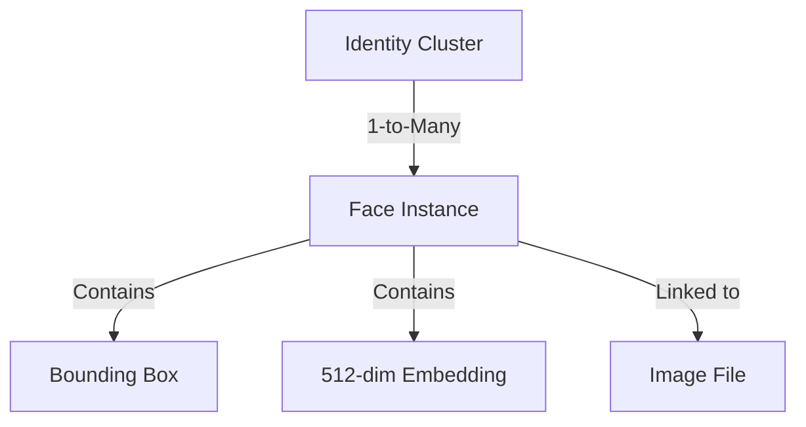

# Identity Graph Specification — QuantileCull V1.2 FP4

This document specifies the design, components, and operations of the persistent face identity graph.

---

## 1. Graph Representation

The identity graph maintains a multi-layer relational model associating individual face crop instances with their parent identity clusters and source files.

* **Identity**: Represents a unique person cluster center (`identity_clusters` table).
* **Face Instance**: Represents a single crop instance containing landmarks, orientation, quality, and embedding (`identity_faces` table).

---

## 2. Graph Operations & History

* **Centroid Recalculation**: When a face is added or removed, the running average embedding centroid is recalculated:
  $$\vec{C}_{new} = \frac{N \cdot \vec{C}_{old} + \vec{E}}{N + 1}$$
* **Consolidation**: Centroids are always normalized to unit length (L2 norm) after updates.
* **History Logs**: Merges and splits are logged inside the `cluster_history` table:
  * `merge`: Consolidates two cluster nodes.
  * `split`: Extracts specific face IDs from a parent cluster node to form a new cluster.
