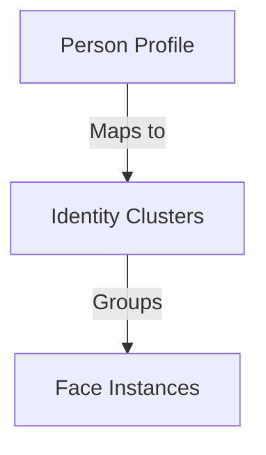

# Identity Resolution Specification — QuantileCull V1.2 FP5

This document specifies the user-facing resolved identity database, timeline mapping, and search query engines.

---

## 1. Relational Identity Mapping

Person Recognition sits as a decoupled metadata layer over the clustering engine:

* **Person**: Defined in `persons` table. Holds unique name, notes, creation timestamp, face count, and key face crop references.
* **Association**: Clusters are mapped to persons using the `person_id` reference on the `identity_clusters` table.

---

## 2. API Operations

* **timeline**: `get_identity_timeline(person_id)` queries all associated face instances, groups appearances, and returns them ordered chronologically by source image timestamp.
* **search**: `search_photos_by_person(person_id)` retrieves all distinct file paths where the person's face was resolved.
* **migration**: `migrate_unresolved_identities()` scans unassigned active clusters, auto-creates generic person nodes (e.g. "Person 1"), and maps the nodes.
